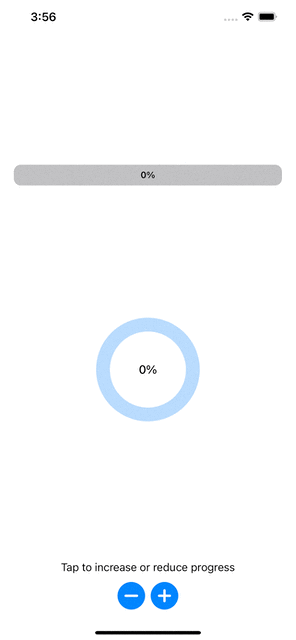

# SwiftUI-ProgressBar
Simple example of a linear and ring progress bars implementation in SwiftUI.

# Introduction
This is a simple implementation in SwiftUI of a linear progress bar and a ring progress bar.

You can customize the bar appearance using the constructor. You can customize the color, the background color and the corner radius of the bars and the percentage label color *(At this moment, the percentage label only shows integer values)*.

You can set the frame of the bars using the **.frame()** modifier. The Linear Progress Bar takes all the available space by default, so it's recommended to add an horizontal padding.

# Technologies
* SwiftUI

# Author
David Mendoza
